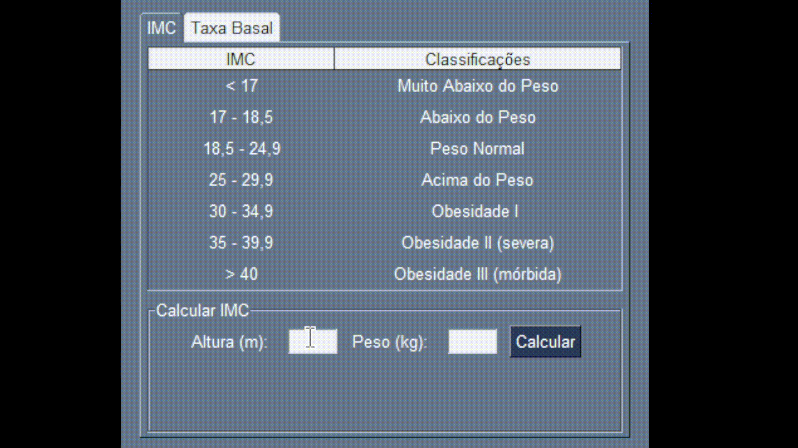

# 📊 Calculadora de IMC e Taxa Metabólica Basal 🚀

## 📝 Descrição
Este projeto é uma aplicação gráfica desenvolvida em Python usando a biblioteca **PySimpleGUI**. Ele permite calcular o **Índice de Massa Corporal (IMC)** e a **Taxa Metabólica Basal (TMB)** com base nos dados fornecidos pelo usuário.

## 🌟 Funcionalidades
- **📏 Cálculo de IMC:** Insira altura e peso para calcular seu IMC e receber uma classificação com base nos valores.
- **📋 Tabela de Classificação IMC:** Consulte uma tabela com as faixas de classificação do IMC.
- **🔥 Cálculo de Taxa Metabólica Basal (TMB):** Insira altura, peso, idade e selecione o gênero para calcular sua TMB.
- **🖥️ Interface Gráfica Intuitiva:** Navegue entre abas separadas para IMC e TMB.

## 🛠️ Tecnologias Utilizadas
- **🐍 Python 3.11.7**
- **🎨 PySimpleGUI**

## 🚀 Como Executar o Projeto
1. Clone este repositório:
   ```bash
   git clone https://github.com/CauanNeves/calculo-imc.git
   ```
2. Instale as dependências:
   ```bash
   pip install PySimpleGUI
   ```
3. Execute o programa:
   ```bash
   python App.py
   ```

## 🧠 Como Usar
### 🧮 Aba IMC
1. Insira sua **📐 Altura (m)** e **⚖️ Peso (kg)**.
2. Clique no botão **🟢 Calcular**.
3. Veja seu resultado exibido com a classificação e cor correspondente.

### 💪 Aba Taxa Basal
1. Selecione seu **⚤ Gênero**.
2. Insira **📐 Altura (m)**, **⚖️ Peso (kg)** e **🎂 Idade**.
3. Clique em **🟢 Calcular**.
4. Veja o resultado exibido.

## 📺 Demonstação:


## 🤝 Contribuição
Contribuições são bem-vindas! Sinta-se à vontade para abrir um **pull request**.


## 👤 Autor
- **Cauan Neves** - [💼 LinkedIn](https://www.linkedin.com/in/cauan-neves-65916a228/)

---
*Feito com 🐍 e PySimpleGUI 💻.*
